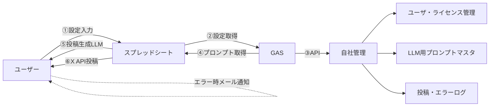

# X自動投稿ツール概要

Google Apps Script（GAS）とGoogleスプレッドシートを活用した、X（旧Twitter）自動投稿ツール（MVP）

---

## システム構成図（フローチャート）

---

## 概要
- **ライセンス認証・制限管理**
- **プロンプトベースの投稿生成**
- **X（Twitter）への自動投稿（API部分はモック）**
- **スケジュール投稿**
- **セキュリティ監視・エラー通知**
- **UI改善（カテゴリのドロップダウンリスト）**

---

## ファイル構成
- `LicenseManager.gs` … ライセンス認証・制限管理
- `PromptManager.gs` … プロンプト管理
- `TwitterPostManager.gs` … 投稿生成・X投稿
- `SecurityMonitor.gs` … セキュリティ監視
- `ErrorMonitor.gs` … エラー通知
- `Api.gs` … APIエンドポイント（doPost）
- `Init.gs` … スプレッドシート初期化・自動投稿・スケジュール
- `project.md` … 要件・設計ドキュメント

---

## セットアップ手順
1. Googleスプレッドシートを新規作成し、拡張機能 → Apps Script を開く。
2. 各 `.gs` ファイルの内容をApps Scriptプロジェクトにファイル分割して貼り付ける。
3. `initializeSpreadsheet` 関数を実行し、必要なシートを自動生成。
4. 「設定」シートに Email、License ID、APIキー等を入力。
5. 「メイン実行」シートに投稿パラメータ（カテゴリ、サブカテゴリ、入力、Xアカウント）を入力。
6. `executeAutoPost` 関数を手動実行、または `setSchedule` で自動化。

---

## シート構成
- **設定** … Email、License ID、APIキー
- **メイン実行** … カテゴリ、サブカテゴリ、入力、Xアカウント
- **ライセンス管理** … Email、License ID、制限設定
- **プロンプト管理** … カテゴリ、サブカテゴリ、プロンプト内容
- **投稿ログ** … 日時、投稿内容、ステータス
- **エラーログ** … 日時、エラー内容、ステータス

---

## 注意事項
- X（Twitter）API連携部分はモック実装です。実運用にはAPI連携の実装が必要です。
- セキュリティ通知は管理者メール宛に送信されます。

---

## ライセンス
MIT License

---

# x_automation_JP
